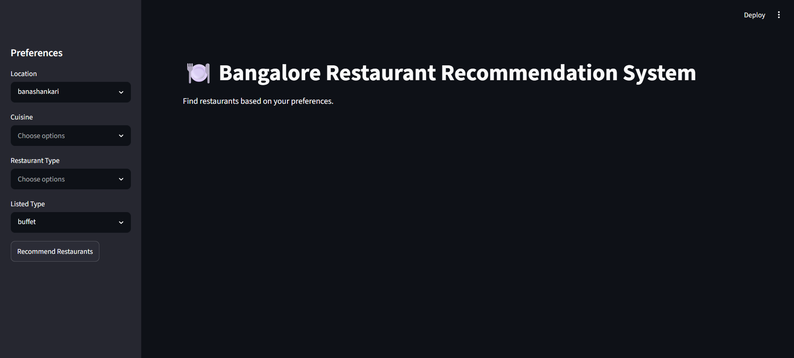
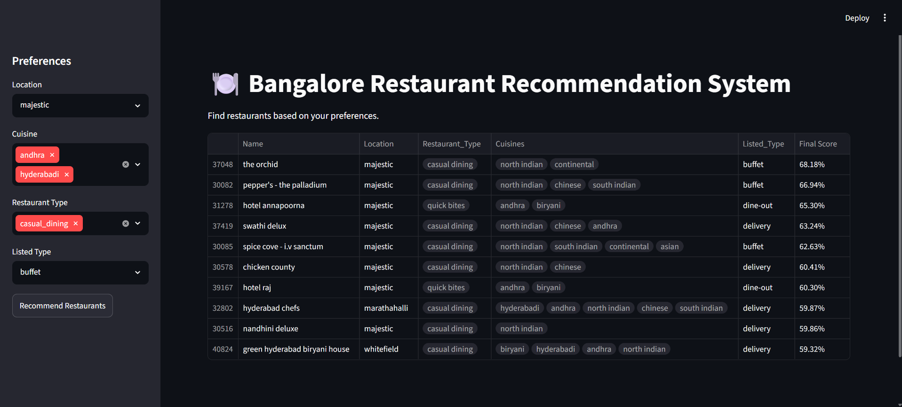

# 🍽️ Bangalore Restaurant Recommendation System

A content-based Restaurant Recommendation System built using the **Zomato Bangalore Restaurants Dataset**. Users can select their preferred location, cuisines, restaurant types, and listed type, and the system recommends the most similar restaurants using **TF-IDF Vectorization** and **Cosine Similarity**.

Built with **Python**, **Scikit-learn**, **Pandas**, and **Streamlit**.

---

## 📌 Features

- Recommend restaurants based on user preferences
- Content-based recommendation using TF-IDF
- Cosine Similarity for finding similar restaurants
- Interactive Streamlit interface
- Support for multiple cuisines and restaurant types
- Feature Aware Tokenization
- Preserving multi-word features during vectorization
- Improved recommendation ranking using restaurant ratings and votes

---

## 📂 Project Structure

```

Bangalore-Restaurant-Recommender/
├── app.py
├── datasets/
│   └── zomato_data_cleaned.csv
├── images/
│   ├── dashboard.png
│   └── output.png
├── notebooks/
│   └── dataset_cleaner.ipynb
├── pyproject.toml
├── README.md
├── src/
│   ├── feature_engineer.py
│   ├── preprocessing.py
│   └── recommender.py
└── uv.lock

```

---

## 🛠️ Technologies Used

- Python 3.12
- Pandas
- NumPy
- Scikit-learn
- Streamlit

---

## 🧹 Data Preprocessing

The original Zomato Bangalore dataset was cleaned by removing unnecessary columns, duplicate records, and rows with missing values. Text fields were normalized, and multi-valued features such as cuisines and restaurant types were split into lists for further processing.

The final dataset contains the following features:

- Name
- Location
- Restaurant Type
- Cuisines
- Listed Type
- Listed City
- Online Order
- Book Table
- Rate
- Votes

---

## 🧠 Feature Engineering

Each restaurant is converted into a text document by combining:

- Location
- Listed Type
- Restaurant Type
- Cuisines

Example:

```
location_whitefield
listed_buffet
type_casual_dining
cuisine_north_indian
cuisine_chinese
```

These documents are then transformed into TF-IDF vectors.

---

## 🚀 How Recommendations Work

1. The user selects:
    - Location
    - Cuisine(s)
    - Restaurant Type(s)
    - Listed Type

2. User preferences are converted into a feature-aware document using prefixed tokens (e.g., location_whitefield, cuisine_north_indian).

3. The document is transformed into a TF-IDF vector.

4. Cosine similarity is computed between the user's preference vector and every restaurant.

5. Restaurants are re-ranked using a weighted combination of similarity score, normalized rating, and normalized vote count.

```text
Final Score = 70% × Similarity Score
            + 20% × Normalized Rating
            + 10% × Normalized Vote Count
```

---

## ▶️ Running the Project

### Clone the repository

```bash
git clone https://github.com/VRYeshwanth/Bangalore-Restaurant-Recommender.git

cd Bangalore-Restaurant-Recommender
```

### Create a virtual environment

```bash
uv venv
```

### Activate the virtual environment

**Windows**

```bash
.venv\Scripts\activate
```

**Linux / macOS**

```bash
source .venv/bin/activate
```

### Install dependencies

```bash
uv sync
```

### Run the application

```bash
streamlit run app.py
```

## 📷 Demo





---

## 📖 Dataset

Dataset Link: [Click Here](https://www.kaggle.com/datasets/leshyatha/zomato-bangalore-restaurants)

---

## 🤝 Contributing

Contributions, suggestions, and improvements are welcome.

Feel free to fork the repository and submit a pull request.

---
